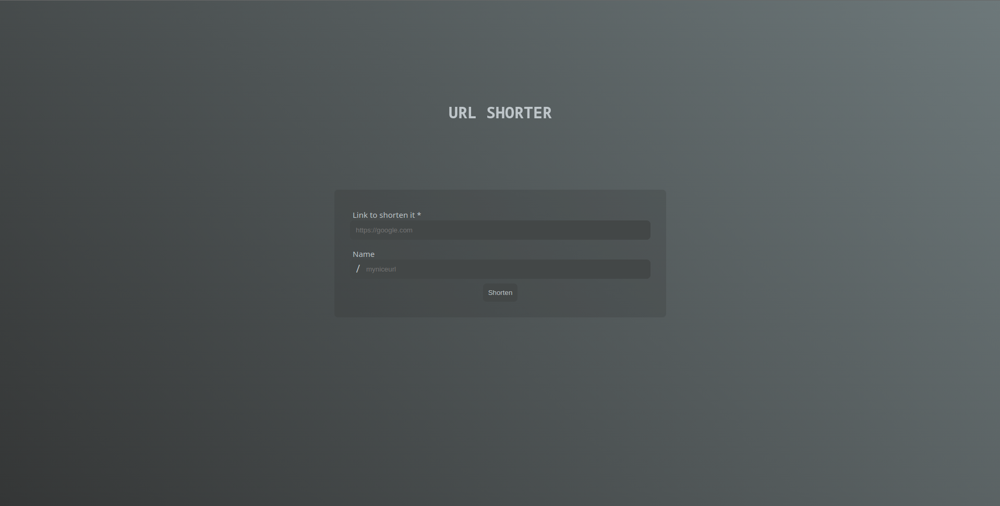

# URL SHORTER



## How to install

Run docker compose:

```bash
docker compose up -d
```

---

After installing, just access http://localhost:8000

## How to test

Access docker and enter the following command:

```bash
python manage.py test
```
